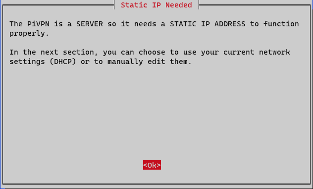
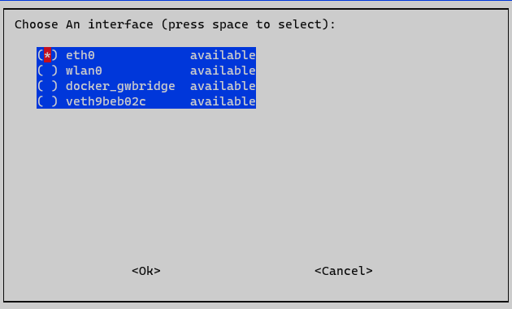
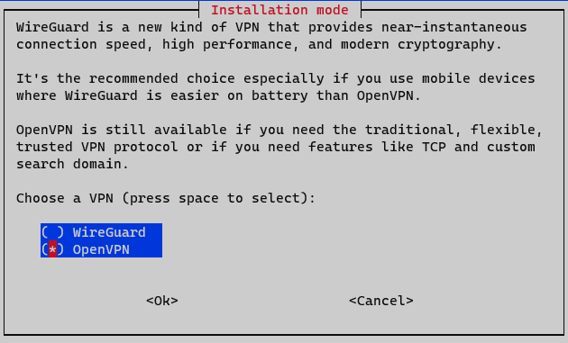
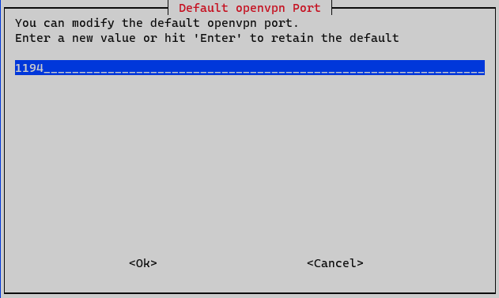
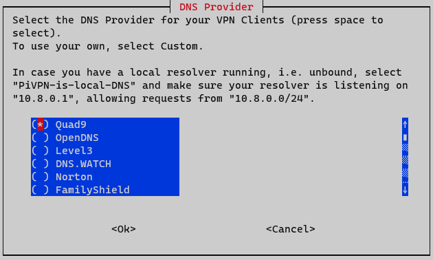

# Secure Suite
      


Secure Suite. An open source software package that uses machine learning to increase the user's general internet security.

Secure Suite offers a secure password manager. It also processes browser traffic to mitigate the risk of navigating to a URL that hosts malicious web services.


## Run the full application
```
git clone https://github.com/haney-oliver/secure-suite.git
cd docker
docker-compose up
```
Navigate to `http://localhost:8080`.


### App services and port bindings
| service name | port bindings |
|---|---|
| app-db | 33060:3306 |
| audit-db | 33061:3306 |
| zookeeper | 2181:2181 |
| kafka | 9092:9092 |
| maxwell | N/A |
| frontend | 8080:8080 |
| backend | 5000:5000 |


## Configuring PiVPN for easy access to Secure Suite server
Log into your raspberry pi.
Enter:
```
curl -L https://install.pivpn.io | bash
```
into the terminal.

Step through the after all packages have installed configuration UI.
If you do not have a static IP configured for the pi you will need to do so
in case your router assigns a different IP address to the pi.



Then choose which network interface the PiVPN should give access to.



Use OpenVPN.



Choose a port for the server to run on (You should probably just leave it as the default value).



Configure the DNS server. Any will suffice.



Then configure the VPN to broadcast on your public DHCP.

After that, reboot the system and log back into the pi.
Enter:
```
pivpn add
```

Then follow the prompts until you have a device certificate.

You can use this file to add a profile on [OpenVPN Connect](https://openvpn.net/download-open-vpn/)


### Other projects featured in Secure Suite
[Maxwell's Daemon](https://github.com/zendesk/maxwell)

[Kafka](https://github.com/wurstmeister/kafka-docker)

